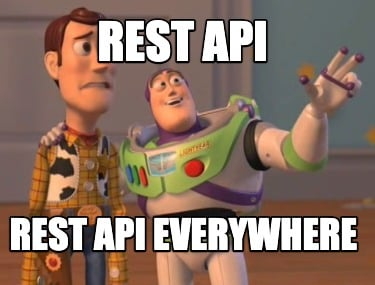

# API REST Flask con Docker
​
Ejemplo de API REST hecha con Python, Flask y Docker.

- Para obtener todos los usuarios:
    - `GET http://localhost:5000/user/all`
​
- Para obtener un usuario por nombre:
    - `GET http://localhost:5000/user?name="muchelle"`

- Para crear un usuario:
    - `POST http://localhost:5000/user`

Body:
```javascript 
{
  "name": "miguel",
  "email": "miguel@gmail.com"
}
```

- Para borrar un usuario:
    - `DELETE http://localhost:5000/user`

Body:
```javascript 
{
"email": "alejandru@gmail.com",
"name":"alejandru"
}
```

- Para editar un usuario:
    - `POST http://localhost:5000/user`

Body:
```javascript 
{
"email": "alejandru@gmail.com",
"name":"alejandru",
"new_email":"juampy@gmail.com",
"new_name":"juampy"
}
```

## A jugar!
 